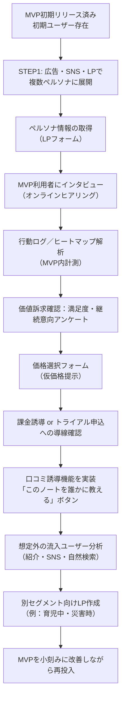

# LeaveNote_事業仮説.md

## STEP1 仮説の整理

### 👤顧客仮説

- 長期旅行や帰省などで家を一定期間空けるユーザー（主に20代〜40代）
  - 共働き家庭
  - 一人暮らしの社会人
  - 子育て中の家庭
- 家の不在中に不安を感じるが、スマートデバイスや複雑なサービスには抵抗がある人たち

---

### 🧱課題仮説

- 外出前に「やり残し」がないか不安（エアコン、郵便、宅配、戸締り）
- 万が一の連絡手段・連絡先をきちんと整理していない
- 家族や友人、近隣者に頼みごとをすることに心理的ハードルがある
- LINEや紙メモなどでは情報が分散してしまい管理しづらい

---

### 💎価値仮説

- 外出前にやるべきこと、お願いしたいこと、緊急連絡先などをWeb上で一元管理できることで安心感が得られる
- 情報をURLで安全に共有できることで、頼みごとの心理的ハードルが下がる
- 外出中・帰宅後の振り返り機能により、次回の外出準備が楽になる

---

### 🛠️ソリューション仮説

- 旅行チェックリスト機能
- お願いメモ作成と共有（閲覧パスワード設定、期限付きURL）
- 緊急連絡先管理機能（「もしもノート」）
- 旅行モードON/OFFの切り替え管理
- 旅行後の振り返りメモ（リフレクション）機能

---

### 💰収益モデル仮説

- フリーミアムモデル（無料プラン＋プレミアム機能）
  - 無料：基本ノート作成／共有
  - 有料：ノート複数保存、PDF出力、連携テンプレート、通知リマインダー等
- プレミアム価格帯は月額300〜500円程度が妥当と予想

---

### 🚪チャネル仮説

- Google検索（「旅行前のやることリスト」「もしもノート」など）
- SNS広告（Instagram・X）
- 旅行・防災系ブログとの提携
- 家族向けメディアでの紹介記事
- 実際に利用したユーザーからの口コミ誘導

---

### 🌱スケーラビリティ仮説

- 「不在時の備え」から「災害時」「育児中」「入院中」などの他のライフイベントへの応用が可能
- 法人向け：社員の緊急連絡先管理や在宅勤務チェックリスト管理などにも展開できる

---

## STEP2 仮説検証計画（Mermaid）

