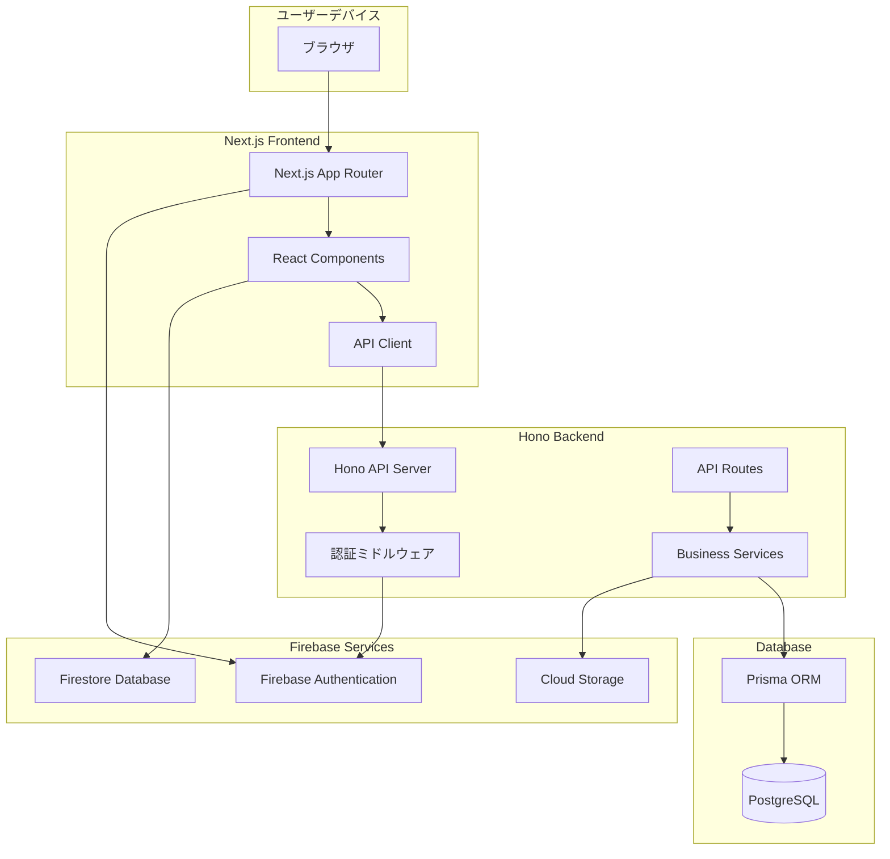
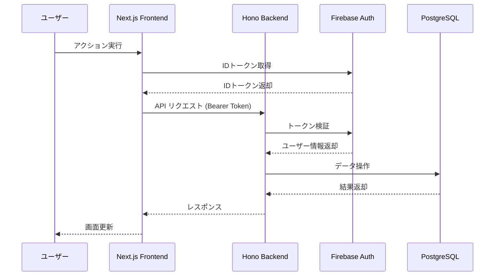
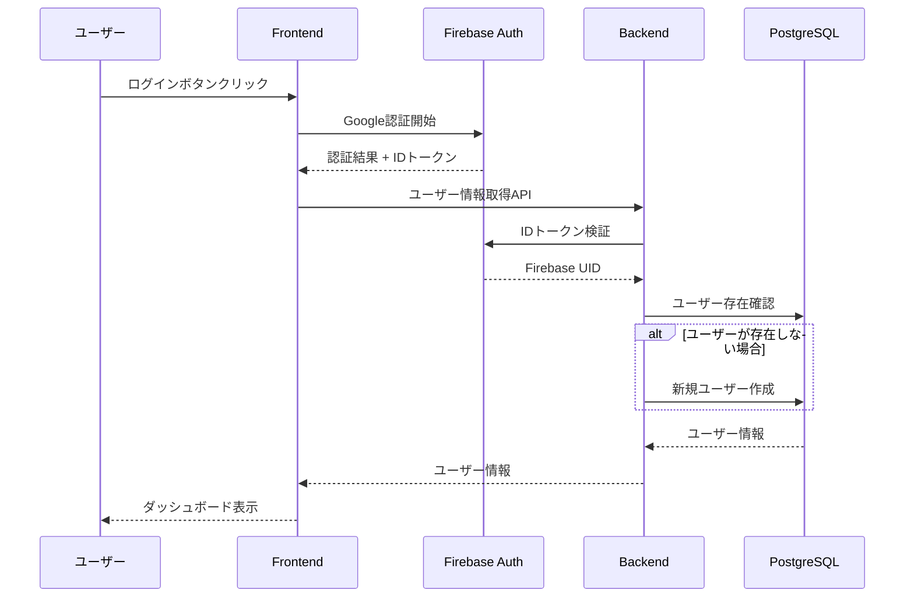
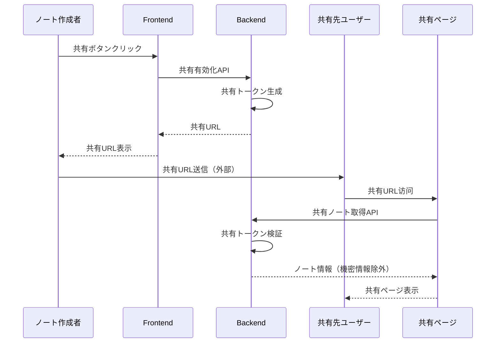

# アーキテクチャ設計書

## システム概要

**LeaveNote（リーブノート）**は、旅行前の"やり残し"や"もしものとき"の不安を整理・共有するWeb完結型の安心ノートサービスです。

### 主要コンポーネント
- **フロントエンド**: Next.js (React 19) - ユーザーインターフェース
- **バックエンド**: Hono + TypeScript - API サーバー
- **データベース**: PostgreSQL - メインデータストレージ
- **認証**: Firebase Authentication - ユーザー認証
- **リアルタイム**: Firestore - リアルタイム通信（将来機能）
- **ファイルストレージ**: Cloud Storage for Firebase - ファイル保存（将来機能）

## 設計方針

### ガイドライン準拠
- **アーキテクチャ**: docs/architecture_guideline.md に基づく設計
- **API**: docs/api_development_guideline.md に基づく設計
- **機能**: 機能設計書に基づく実装

### アーキテクチャパターン
- **パターン**: シンプルな3層アーキテクチャ
- **理由**: 
  - プロジェクト規模に適したシンプルな構成
  - 開発・運用の複雑性を最小限に抑制
  - 将来的な拡張にも対応可能
  - ガイドラインとの整合性

### 設計原則
1. **シンプル・イズ・ベスト**: 過度な複雑性を避ける
2. **セキュリティファースト**: 個人情報を扱うため安全性を最優先
3. **スケーラビリティ**: 将来の成長に対応可能な設計
4. **保守性**: 理解しやすく変更しやすいコード

## システムアーキテクチャ

### 全体構成図



### レイヤー構成

#### プレゼンテーション層（Frontend）
- **責務**: ユーザーインターフェースの提供
- **技術**: Next.js 14+ (App Router), React 19, TypeScript
- **構成**:
  - Page Components: 各画面のメインコンポーネント
  - UI Components: 再利用可能なUIコンポーネント
  - API Client: openapi-fetchによる型安全なAPIクライアント
  - State Management: React Hooks + Context API

#### ビジネス層（Backend API）
- **責務**: ビジネスロジックとAPI提供
- **技術**: Hono, TypeScript, Zod
- **構成**:
  - API Routes: エンドポイント定義
  - Middleware: 認証、CORS、エラーハンドリング
  - Services: ビジネスロジック実装
  - Validators: Zodによる入力検証

#### データ層（Database）
- **責務**: データの永続化と管理
- **技術**: PostgreSQL, Prisma ORM
- **構成**:
  - Database Schema: テーブル設計
  - ORM Models: Prismaモデル定義
  - Migrations: データベーススキーマ変更管理

#### 認証・外部サービス層
- **責務**: 認証とクラウドサービス連携
- **技術**: Firebase Authentication, Firestore, Cloud Storage
- **構成**:
  - Authentication: ユーザー認証管理
  - Real-time DB: リアルタイム通信（将来機能）
  - File Storage: ファイル保存（将来機能）

## コンポーネント設計

### フロントエンド構成

#### ディレクトリ構造
```
packages/web/
├── app/                    # Next.js App Router
│   ├── (auth)/            # 認証関連ページ
│   ├── dashboard/         # ダッシュボード
│   ├── create/            # ノート作成
│   ├── note/[id]/         # ノート詳細
│   ├── shared/[id]/       # 共有ページ
│   ├── reflection/        # 振り返り
│   ├── api/              # API Routes (Next.js)
│   └── layout.tsx        # ルートレイアウト
├── components/           # 共通コンポーネント
│   ├── ui/              # UIコンポーネント (shadcn/ui)
│   ├── forms/           # フォームコンポーネント
│   ├── layout/          # レイアウトコンポーネント
│   └── features/        # 機能別コンポーネント
├── hooks/               # カスタムフック
├── lib/                 # ユーティリティ
│   ├── auth.ts         # Firebase認証設定
│   ├── api-client.ts   # APIクライアント
│   └── utils.ts        # 共通ユーティリティ
└── utils/
    └── api-types.ts    # 自動生成API型定義
```

#### 状態管理戦略
- **認証状態**: Firebase Auth + React Context
- **ローカル状態**: React Hooks (useState, useReducer)
- **サーバー状態**: SWR or TanStack Query（将来検討）
- **フォーム状態**: React Hook Form + Zod validation

### バックエンド構成

#### ディレクトリ構造
```
packages/api/
├── src/
│   ├── index.ts              # エントリーポイント
│   ├── routes/               # APIルート定義
│   │   ├── auth.ts          # 認証API
│   │   ├── notes.ts         # ノートAPI
│   │   ├── checklist.ts     # チェックリストAPI
│   │   ├── shared.ts        # 共有API
│   │   ├── reflection.ts    # 振り返りAPI
│   │   └── templates.ts     # テンプレートAPI
│   ├── middleware/           # ミドルウェア
│   │   ├── auth.ts          # 認証ミドルウェア
│   │   ├── cors.ts          # CORS設定
│   │   └── error.ts         # エラーハンドリング
│   ├── services/            # ビジネスロジック
│   │   ├── auth.service.ts
│   │   ├── note.service.ts
│   │   └── template.service.ts
│   ├── lib/                 # ライブラリ
│   │   ├── prisma.ts        # Prisma設定
│   │   ├── firebase.ts      # Firebase Admin設定
│   │   └── validation.ts    # Zodスキーマ
│   └── types/               # 型定義
├── prisma/                  # Prismaスキーマ・マイグレーション
│   ├── schema.prisma
│   └── migrations/
└── tests/                   # テストファイル
```

## データフロー設計

### リクエスト処理フロー



### 認証フロー



### 共有機能フロー



## セキュリティアーキテクチャ

### 認証・認可設計

#### 認証方式
- **Firebase Authentication**: Google認証、匿名認証
- **IDトークン**: JWT形式、1時間有効期限
- **リフレッシュトークン**: 自動更新、Firebase SDK管理

#### 認可制御
```typescript
// 認可レベル定義
enum AuthorizationLevel {
  OWNER = "owner",        // ノート作成者
  SHARED = "shared",      // 共有アクセス
  PUBLIC = "public"       // 公開アクセス（将来）
}

// リソースアクセス制御
interface ResourceAccess {
  noteId: string;
  userId: string;
  level: AuthorizationLevel;
  permissions: Permission[];
}
```

### データ保護

#### 暗号化
- **通信**: HTTPS/TLS 1.3
- **データベース**: PostgreSQL Transparent Data Encryption
- **機密情報**: アプリケーションレベル暗号化（緊急連絡先等）

#### アクセス制御
- **データベース**: 最小権限の原則
- **API**: エンドポイント別認証制御
- **共有**: トークンベースアクセス制御

### セキュリティ対策

#### 一般的な脅威対策
- **XSS**: Content Security Policy, 入力値サニタイゼーション
- **CSRF**: SameSite Cookie, CSRFトークン
- **SQLインジェクション**: Prisma ORM使用、パラメータクエリ
- **認証**: Firebase Authentication、トークン検証

#### 監査・ログ
```typescript
// セキュリティイベントログ
interface SecurityEvent {
  eventType: 'AUTH_SUCCESS' | 'AUTH_FAILURE' | 'UNAUTHORIZED_ACCESS';
  userId?: string;
  ipAddress: string;
  userAgent: string;
  timestamp: Date;
  details: Record<string, any>;
}
```

## パフォーマンス設計

### フロントエンド最適化

#### Next.js最適化
- **App Router**: ファイルベースルーティング
- **Server Components**: サーバーサイドレンダリング
- **Client Components**: 必要最小限の範囲で使用
- **Static Generation**: 静的コンテンツの事前生成

#### バンドル最適化
```typescript
// 動的インポート例
const ReflectionPage = dynamic(() => import('./reflection/page'), {
  loading: () => <Loading />,
  ssr: false
});
```

### バックエンド最適化

#### データベースアクセス
```typescript
// N+1問題対策
const noteWithDetails = await prisma.note.findUnique({
  where: { id: noteId },
  include: {
    checklistItems: true,
    emergencyContacts: true,
    requests: true,
    reflection: true
  }
});
```

#### キャッシュ戦略
- **共有ページ**: Hono Cache Middleware
- **静的コンテンツ**: CDN キャッシュ
- **データベース**: Connection Pooling

### 監視・メトリクス

#### パフォーマンス監視
```typescript
// パフォーマンスメトリクス
interface PerformanceMetrics {
  endpoint: string;
  responseTime: number;
  statusCode: number;
  timestamp: Date;
  userId?: string;
}
```

## 運用アーキテクチャ

### デプロイメント戦略

#### 環境構成
- **開発環境**: ローカル開発環境
- **ステージング環境**: 本番環境のレプリカ
- **本番環境**: 実際のサービス環境

#### CI/CD パイプライン
```yaml
# GitHub Actions ワークフロー例
name: Deploy Pipeline
on:
  push:
    branches: [main]
jobs:
  test:
    runs-on: ubuntu-latest
    steps:
      - name: Run Tests
        run: pnpm test
  deploy:
    needs: test
    runs-on: ubuntu-latest
    steps:
      - name: Deploy to Production
        run: pnpm deploy
```

### 監視・ヘルスチェック

#### アプリケーション監視
```typescript
// ヘルスチェックエンドポイント
app.get('/health', (c) => {
  return c.json({
    status: 'healthy',
    timestamp: new Date().toISOString(),
    version: process.env.APP_VERSION,
    database: 'connected'
  });
});
```

#### ログ管理
- **構造化ログ**: JSON形式での出力
- **ログレベル**: ERROR, WARN, INFO, DEBUG
- **ログ集約**: 外部ログ管理サービス連携

## 拡張性設計

### 水平スケーリング対応

#### ステートレス設計
- **セッション**: Firebase Authenticationで管理
- **ファイルアップロード**: Cloud Storage使用
- **データベース**: Connection Pooling対応

#### マイクロサービス化準備
```typescript
// サービス分離の準備
interface NoteService {
  createNote(data: CreateNoteData): Promise<Note>;
  updateNote(id: string, data: UpdateNoteData): Promise<Note>;
  deleteNote(id: string): Promise<void>;
}

interface AuthService {
  verifyToken(token: string): Promise<User>;
  createUser(userData: CreateUserData): Promise<User>;
}
```

### 将来機能への対応

#### Phase 2 機能準備
- **リアルタイム通信**: Firestore リスナー
- **ファイルアップロード**: Cloud Storage連携
- **通知機能**: Firebase Cloud Messaging

#### Phase 3 機能準備
- **チーム機能**: 権限管理システム拡張
- **外部連携**: WebHook、API連携

## ガイドライン準拠確認

### アーキテクチャガイドライン準拠項目

#### ✅ 基本構成準拠
- Next.js Frontend ←→ Hono API Backend ←→ PostgreSQL Database

#### ✅ 認証システム準拠
- Firebase Authentication使用
- Google認証 + 匿名認証対応
- IDトークンによるAPI認証

#### ✅ リアルタイム通信準拠
- Firestore使用（将来機能として準備）
- WebSocket不使用

#### ✅ ファイルストレージ準拠
- Cloud Storage for Firebase使用（将来機能として準備）
- バックエンドAPI経由のアップロード方式

#### ✅ セキュリティ準拠
- 適切なセキュリティルール設定
- IDトークン検証の実装
- データ暗号化・アクセス制御

### APIガイドライン準拠項目

#### ✅ データベース設計準拠
- PostgreSQL使用
- UUID主キー採用
- スネークケースの命名規則
- Prisma ORM使用

#### ✅ アプリケーション設計準拠
- Hono + TypeScript
- Zod バリデーション
- 適切な型安全性確保

#### ✅ 認証フロー準拠
- Firebase Authentication
- IDトークン検証ミドルウェア
- ユーザー管理テーブル設計

#### ✅ 日時処理準拠
- すべてUTC管理
- ISO 8601形式でのAPI通信
- フロントエンドでのタイムゾーン変換