# データフロー図

## 概要

LeaveNoteシステムにおけるデータの流れと処理フローを可視化し、システム全体のデータインタラクションを理解するためのドキュメントです。

## システム全体データフロー

### 基本アーキテクチャフロー

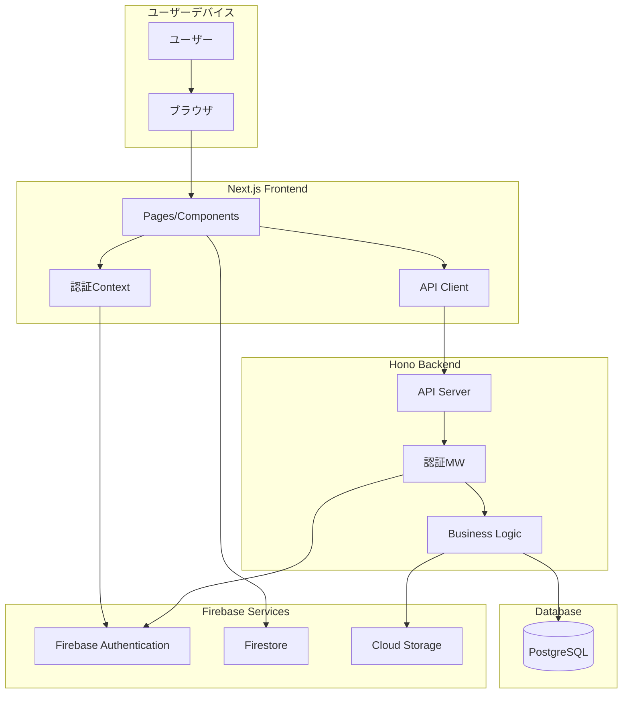

## 主要機能のデータフロー

### 1. ユーザー認証フロー

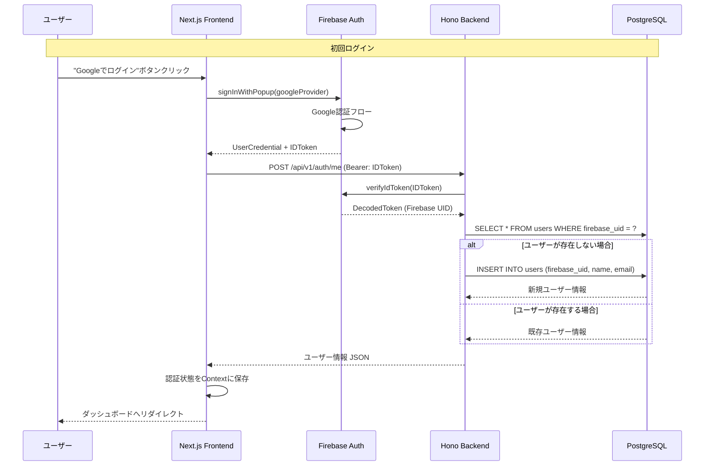

### 2. ノート作成フロー

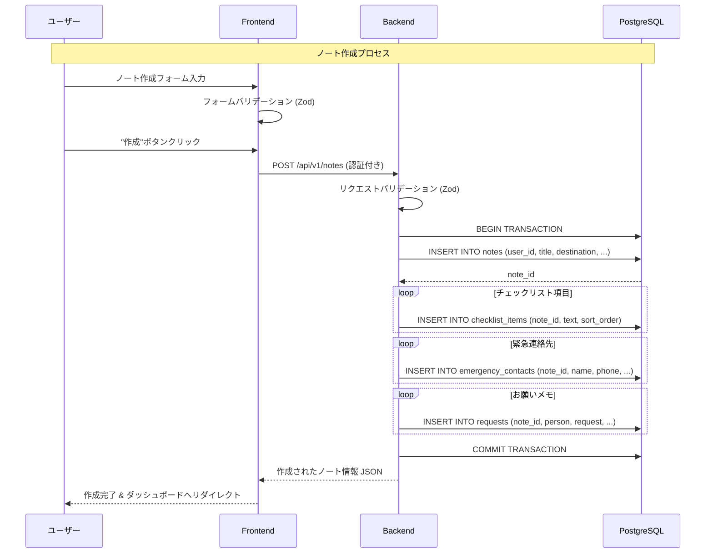

### 3. ノート共有フロー

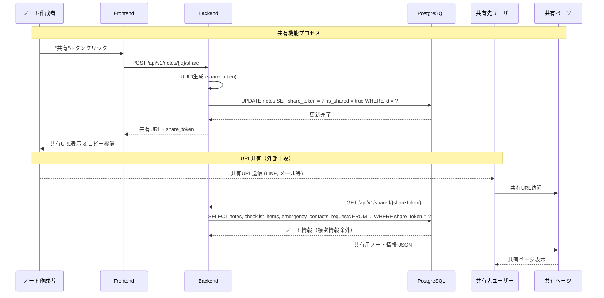

### 4. 振り返り機能フロー

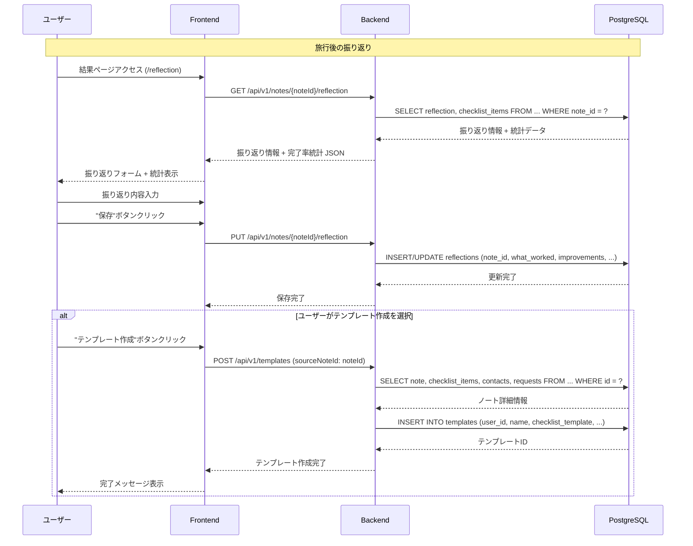

## データ処理フロー詳細

### チェックリスト更新フロー

```mermaid
flowchart TD
    Start([ユーザーがチェックボックスクリック]) --> 
    Frontend[フロントエンドで状態更新] --> 
    OptimisticUpdate{楽観的更新} --> 
    APICall[PUT /api/v1/notes/{noteId}/checklist/{itemId}] --> 
    Validation[バックエンドでバリデーション] --> 
    DBUpdate[データベース更新] --> 
    Response[レスポンス返却] --> 
    Success{成功?}
    
    Success -->|Yes| ProgressCalc[進捗率再計算] --> 
    UIUpdate[UI更新完了] --> 
    End([終了])
    
    Success -->|No| Rollback[楽観的更新をロールバック] --> 
    ErrorDisplay[エラーメッセージ表示] --> 
    End
```

### リアルタイム同期フロー（将来機能）

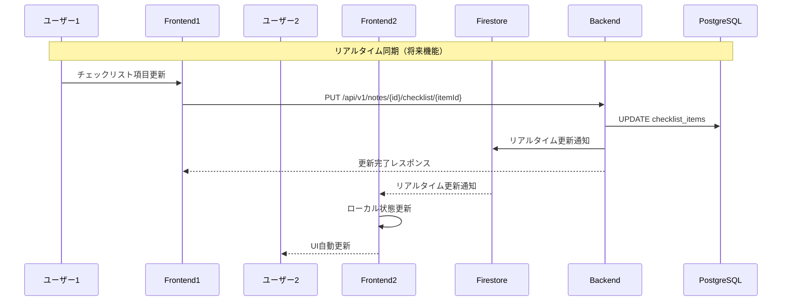

## エラーハンドリングフロー

### API エラー処理フロー

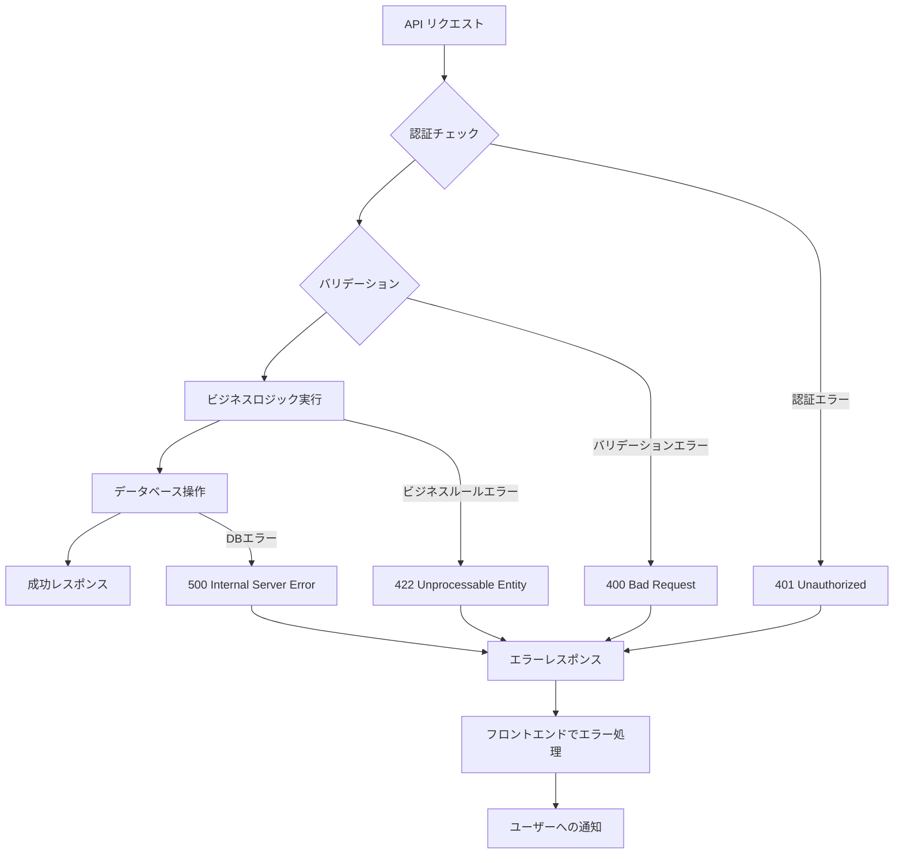

### フロントエンドエラー処理

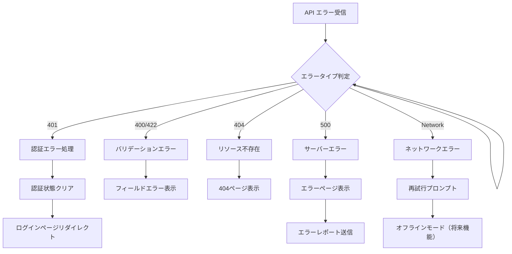

## データ同期・整合性フロー

### 楽観的更新パターン

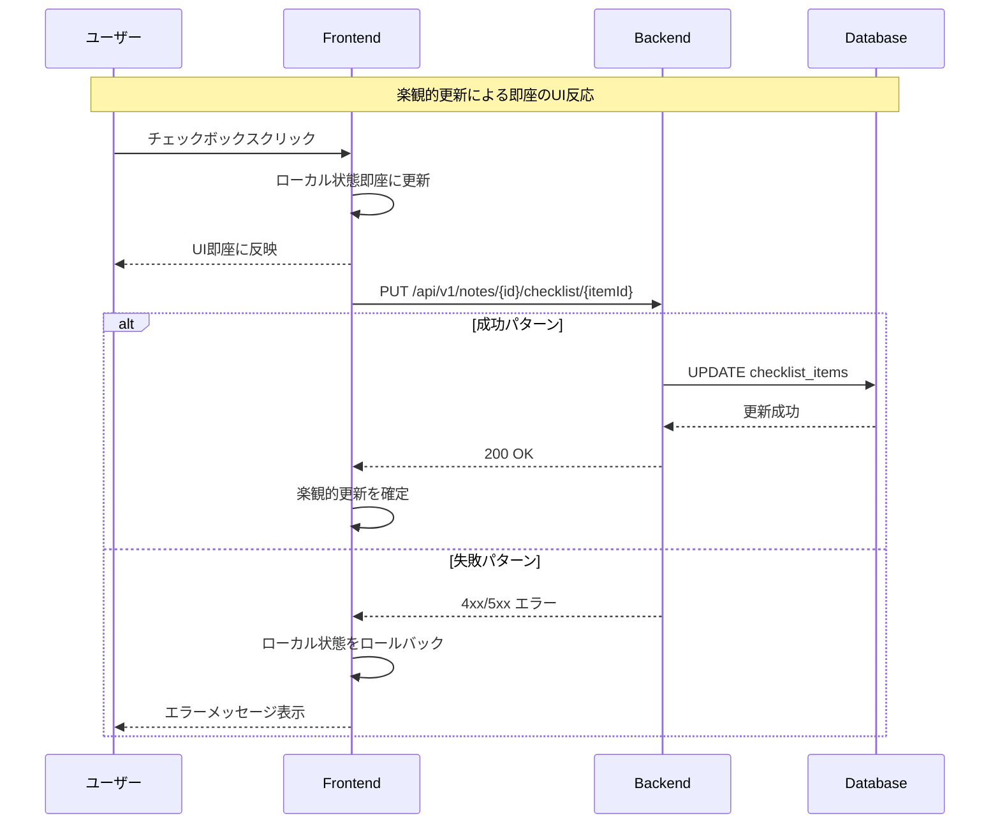

### データ競合解決フロー

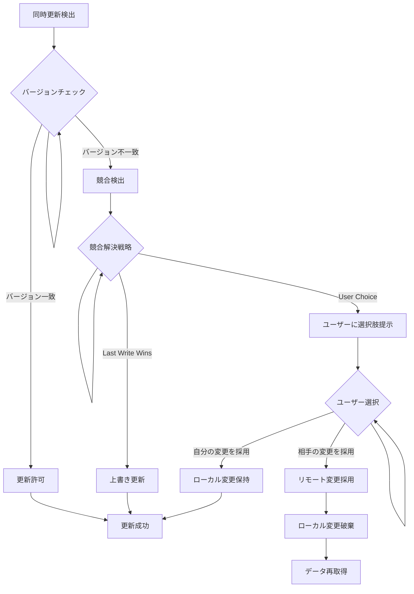

## パフォーマンス最適化フロー

### データ取得最適化

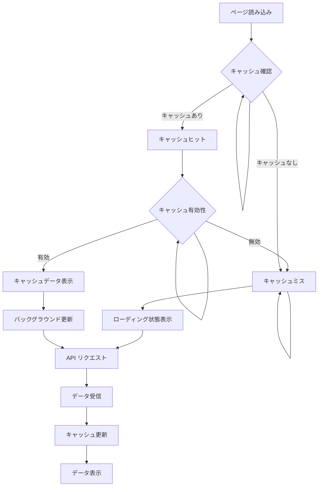

### バッチ処理フロー

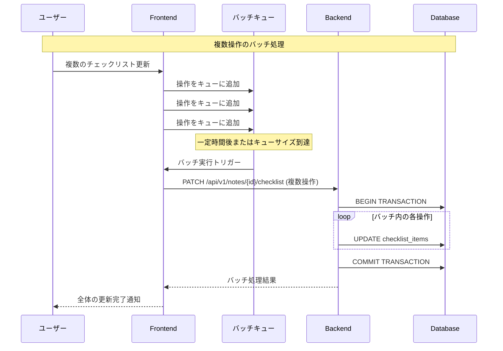

## セキュリティデータフロー

### トークン検証フロー

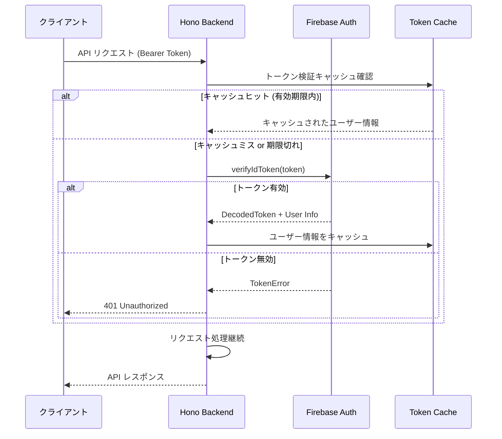

## データフロー設計のベストプラクティス

### 1. エラー伝播の明確化
- 各レイヤーでのエラーハンドリング責務を明確に定義
- ユーザー向けエラーメッセージの一貫性確保
- ログ記録とモニタリングポイントの設定

### 2. パフォーマンス考慮
- 楽観的更新による即座のUI反応
- 適切なキャッシュ戦略の実装
- バッチ処理による効率的な更新

### 3. セキュリティ確保
- 認証トークンの適切な検証
- 機密情報の流出防止
- アクセス権限の厳密なチェック

### 4. 拡張性確保
- 将来のリアルタイム機能への対応準備
- マイクロサービス化を想定した疎結合設計
- 外部サービス連携のためのインターフェース設計