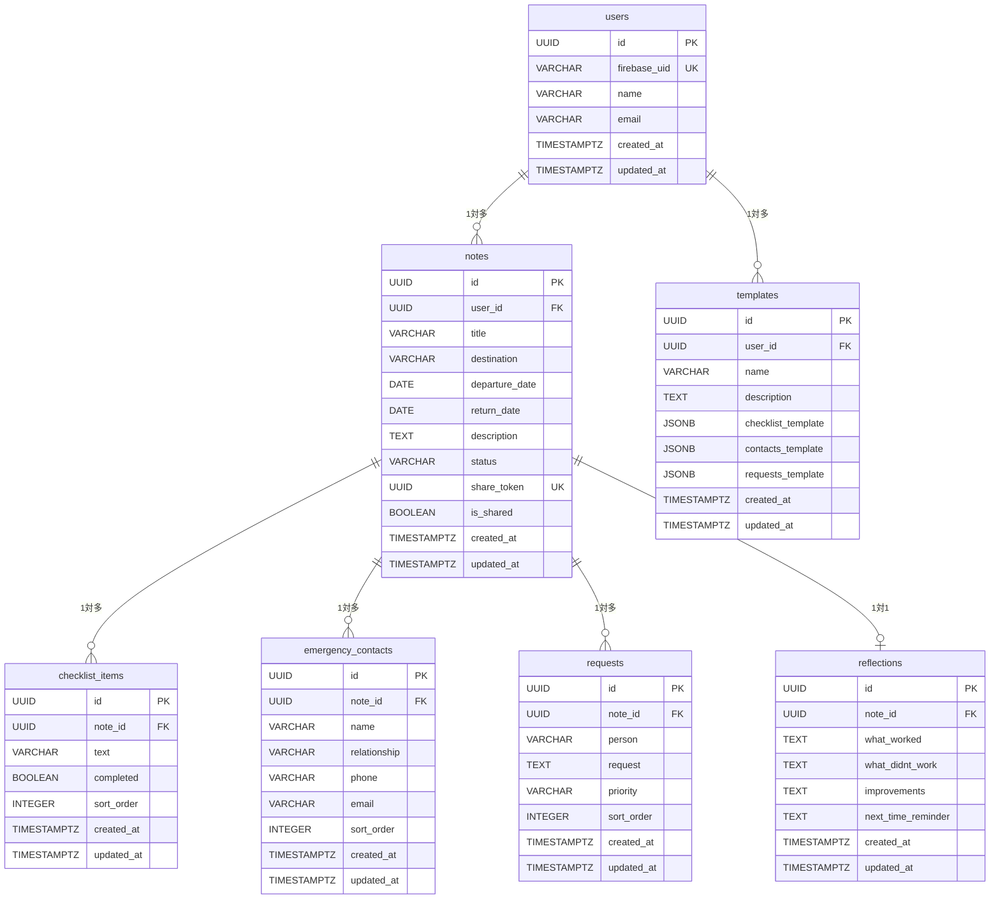

# DB設計書

## 概要
- **DBMS**: PostgreSQL
- **ORM**: Prisma
- **設計方針**: docs/api_development_guideline.md に準拠
- **アーキテクチャ方針**: docs/architecture_guideline.md に準拠

## テーブル設計

### users テーブル
| カラム名 | 型 | 制約 | 説明 |
|---------|---|------|------|
| id | UUID | PRIMARY KEY | ユーザーID |
| firebase_uid | VARCHAR(255) | UNIQUE NOT NULL | Firebase Authentication UID |
| name | VARCHAR(100) | | ユーザー名 |
| email | VARCHAR(255) | | メールアドレス |
| created_at | TIMESTAMPTZ | NOT NULL DEFAULT NOW() | 作成日時 |
| updated_at | TIMESTAMPTZ | NOT NULL DEFAULT NOW() | 更新日時 |

### notes テーブル
| カラム名 | 型 | 制約 | 説明 |
|---------|---|------|------|
| id | UUID | PRIMARY KEY | ノートID |
| user_id | UUID | FOREIGN KEY NOT NULL | ユーザーID |
| title | VARCHAR(200) | NOT NULL | ノートタイトル |
| destination | VARCHAR(100) | NOT NULL | 旅行先 |
| departure_date | DATE | NOT NULL | 出発日 |
| return_date | DATE | NOT NULL | 帰宅日 |
| description | TEXT | | 説明・メモ |
| status | VARCHAR(20) | NOT NULL DEFAULT 'draft' | ステータス（draft/active/completed） |
| share_token | UUID | UNIQUE | 共有用トークン |
| is_shared | BOOLEAN | NOT NULL DEFAULT false | 共有フラグ |
| created_at | TIMESTAMPTZ | NOT NULL DEFAULT NOW() | 作成日時 |
| updated_at | TIMESTAMPTZ | NOT NULL DEFAULT NOW() | 更新日時 |

### checklist_items テーブル
| カラム名 | 型 | 制約 | 説明 |
|---------|---|------|------|
| id | UUID | PRIMARY KEY | チェックリストアイテムID |
| note_id | UUID | FOREIGN KEY NOT NULL | ノートID |
| text | VARCHAR(500) | NOT NULL | チェック項目内容 |
| completed | BOOLEAN | NOT NULL DEFAULT false | 完了フラグ |
| sort_order | INTEGER | NOT NULL DEFAULT 0 | 表示順序 |
| created_at | TIMESTAMPTZ | NOT NULL DEFAULT NOW() | 作成日時 |
| updated_at | TIMESTAMPTZ | NOT NULL DEFAULT NOW() | 更新日時 |

### emergency_contacts テーブル
| カラム名 | 型 | 制約 | 説明 |
|---------|---|------|------|
| id | UUID | PRIMARY KEY | 緊急連絡先ID |
| note_id | UUID | FOREIGN KEY NOT NULL | ノートID |
| name | VARCHAR(100) | NOT NULL | 連絡先名 |
| relationship | VARCHAR(50) | NOT NULL | 続柄・関係 |
| phone | VARCHAR(20) | | 電話番号 |
| email | VARCHAR(255) | | メールアドレス |
| sort_order | INTEGER | NOT NULL DEFAULT 0 | 表示順序 |
| created_at | TIMESTAMPTZ | NOT NULL DEFAULT NOW() | 作成日時 |
| updated_at | TIMESTAMPTZ | NOT NULL DEFAULT NOW() | 更新日時 |

### requests テーブル
| カラム名 | 型 | 制約 | 説明 |
|---------|---|------|------|
| id | UUID | PRIMARY KEY | お願いメモID |
| note_id | UUID | FOREIGN KEY NOT NULL | ノートID |
| person | VARCHAR(100) | NOT NULL | お願いする人 |
| request | TEXT | NOT NULL | お願い内容 |
| priority | VARCHAR(10) | NOT NULL DEFAULT 'medium' | 優先度（high/medium/low） |
| sort_order | INTEGER | NOT NULL DEFAULT 0 | 表示順序 |
| created_at | TIMESTAMPTZ | NOT NULL DEFAULT NOW() | 作成日時 |
| updated_at | TIMESTAMPTZ | NOT NULL DEFAULT NOW() | 更新日時 |

### reflections テーブル
| カラム名 | 型 | 制約 | 説明 |
|---------|---|------|------|
| id | UUID | PRIMARY KEY | 振り返りID |
| note_id | UUID | FOREIGN KEY NOT NULL | ノートID |
| what_worked | TEXT | | うまくいったこと |
| what_didnt_work | TEXT | | うまくいかなかったこと |
| improvements | TEXT | | 次回改善したいこと |
| next_time_reminder | TEXT | | 次回忘れずにやりたいこと |
| created_at | TIMESTAMPTZ | NOT NULL DEFAULT NOW() | 作成日時 |
| updated_at | TIMESTAMPTZ | NOT NULL DEFAULT NOW() | 更新日時 |

### templates テーブル
| カラム名 | 型 | 制約 | 説明 |
|---------|---|------|------|
| id | UUID | PRIMARY KEY | テンプレートID |
| user_id | UUID | FOREIGN KEY NOT NULL | ユーザーID |
| name | VARCHAR(100) | NOT NULL | テンプレート名 |
| description | TEXT | | テンプレート説明 |
| checklist_template | JSONB | | チェックリストテンプレート |
| contacts_template | JSONB | | 緊急連絡先テンプレート |
| requests_template | JSONB | | お願いメモテンプレート |
| created_at | TIMESTAMPTZ | NOT NULL DEFAULT NOW() | 作成日時 |
| updated_at | TIMESTAMPTZ | NOT NULL DEFAULT NOW() | 更新日時 |

## ER図



## インデックス設計

### users テーブル
- **PRIMARY KEY**: id
- **UNIQUE INDEX**: firebase_uid (認証時の高速検索)

### notes テーブル
- **PRIMARY KEY**: id
- **INDEX**: user_id (ユーザー別のノート検索)
- **INDEX**: status (ステータス別検索)
- **UNIQUE INDEX**: share_token (共有URL生成時の重複チェック)
- **INDEX**: departure_date (日付範囲検索)

### checklist_items テーブル
- **PRIMARY KEY**: id
- **INDEX**: note_id (ノート別のチェックリスト取得)
- **INDEX**: (note_id, sort_order) (表示順序での取得)

### emergency_contacts テーブル
- **PRIMARY KEY**: id
- **INDEX**: note_id (ノート別の緊急連絡先取得)
- **INDEX**: (note_id, sort_order) (表示順序での取得)

### requests テーブル
- **PRIMARY KEY**: id
- **INDEX**: note_id (ノート別のお願いメモ取得)
- **INDEX**: (note_id, priority, sort_order) (優先度・表示順序での取得)

### reflections テーブル
- **PRIMARY KEY**: id
- **UNIQUE INDEX**: note_id (1ノートに1振り返りの制約)

### templates テーブル
- **PRIMARY KEY**: id
- **INDEX**: user_id (ユーザー別のテンプレート取得)

## データ制約とビジネスルール

### notes テーブル
- **ステータス制約**: status IN ('draft', 'active', 'completed')
- **日付制約**: return_date >= departure_date
- **共有制約**: is_shared = true の場合、share_token IS NOT NULL

### checklist_items テーブル
- **文字数制限**: text は500文字以内
- **ソート制約**: sort_order >= 0

### emergency_contacts テーブル
- **連絡手段制約**: phone IS NOT NULL OR email IS NOT NULL
- **文字数制限**: name は100文字以内

### requests テーブル
- **優先度制約**: priority IN ('high', 'medium', 'low')
- **文字数制限**: request は2000文字以内

### templates テーブル
- **JSON形式**: checklist_template, contacts_template, requests_template は有効なJSON

## マイグレーション計画

### Phase 1: 基本テーブル作成
1. **users テーブル作成**
2. **notes テーブル作成**
3. **外部キー制約追加** (notes.user_id → users.id)

### Phase 2: 詳細テーブル作成
1. **checklist_items テーブル作成**
2. **emergency_contacts テーブル作成**
3. **requests テーブル作成**
4. **外部キー制約追加** (各テーブル → notes.id)

### Phase 3: 拡張テーブル作成
1. **reflections テーブル作成**
2. **templates テーブル作成**
3. **外部キー制約追加**

### Phase 4: インデックス・制約追加
1. **パフォーマンス用インデックス作成**
2. **CHECK制約追加**
3. **トリガー作成** (updated_at自動更新)

## Prismaスキーマ定義

```prisma
generator client {
  provider = "prisma-client-js"
}

datasource db {
  provider = "postgresql"
  url      = env("DATABASE_URL")
}

model User {
  id          String   @id @default(cuid()) @map("id")
  firebaseUid String   @unique @map("firebase_uid")
  name        String?  @map("name")
  email       String?  @map("email")
  createdAt   DateTime @default(now()) @map("created_at")
  updatedAt   DateTime @updatedAt @map("updated_at")
  
  notes       Note[]
  templates   Template[]
  
  @@map("users")
}

model Note {
  id            String   @id @default(cuid()) @map("id")
  userId        String   @map("user_id")
  title         String   @map("title")
  destination   String   @map("destination")
  departureDate DateTime @map("departure_date") @db.Date
  returnDate    DateTime @map("return_date") @db.Date
  description   String?  @map("description")
  status        String   @default("draft") @map("status")
  shareToken    String?  @unique @map("share_token")
  isShared      Boolean  @default(false) @map("is_shared")
  createdAt     DateTime @default(now()) @map("created_at")
  updatedAt     DateTime @updatedAt @map("updated_at")
  
  user              User               @relation(fields: [userId], references: [id], onDelete: Cascade)
  checklistItems    ChecklistItem[]
  emergencyContacts EmergencyContact[]
  requests          Request[]
  reflection        Reflection?
  
  @@map("notes")
}

model ChecklistItem {
  id        String   @id @default(cuid()) @map("id")
  noteId    String   @map("note_id")
  text      String   @map("text")
  completed Boolean  @default(false) @map("completed")
  sortOrder Int      @default(0) @map("sort_order")
  createdAt DateTime @default(now()) @map("created_at")
  updatedAt DateTime @updatedAt @map("updated_at")
  
  note      Note     @relation(fields: [noteId], references: [id], onDelete: Cascade)
  
  @@map("checklist_items")
}

model EmergencyContact {
  id           String   @id @default(cuid()) @map("id")
  noteId       String   @map("note_id")
  name         String   @map("name")
  relationship String   @map("relationship")
  phone        String?  @map("phone")
  email        String?  @map("email")
  sortOrder    Int      @default(0) @map("sort_order")
  createdAt    DateTime @default(now()) @map("created_at")
  updatedAt    DateTime @updatedAt @map("updated_at")
  
  note         Note     @relation(fields: [noteId], references: [id], onDelete: Cascade)
  
  @@map("emergency_contacts")
}

model Request {
  id        String   @id @default(cuid()) @map("id")
  noteId    String   @map("note_id")
  person    String   @map("person")
  request   String   @map("request")
  priority  String   @default("medium") @map("priority")
  sortOrder Int      @default(0) @map("sort_order")
  createdAt DateTime @default(now()) @map("created_at")
  updatedAt DateTime @updatedAt @map("updated_at")
  
  note      Note     @relation(fields: [noteId], references: [id], onDelete: Cascade)
  
  @@map("requests")
}

model Reflection {
  id               String   @id @default(cuid()) @map("id")
  noteId           String   @unique @map("note_id")
  whatWorked       String?  @map("what_worked")
  whatDidntWork    String?  @map("what_didnt_work")
  improvements     String?  @map("improvements")
  nextTimeReminder String?  @map("next_time_reminder")
  createdAt        DateTime @default(now()) @map("created_at")
  updatedAt        DateTime @updatedAt @map("updated_at")
  
  note             Note     @relation(fields: [noteId], references: [id], onDelete: Cascade)
  
  @@map("reflections")
}

model Template {
  id                String   @id @default(cuid()) @map("id")
  userId            String   @map("user_id")
  name              String   @map("name")
  description       String?  @map("description")
  checklistTemplate Json?    @map("checklist_template")
  contactsTemplate  Json?    @map("contacts_template")
  requestsTemplate  Json?    @map("requests_template")
  createdAt         DateTime @default(now()) @map("created_at")
  updatedAt         DateTime @updatedAt @map("updated_at")
  
  user              User     @relation(fields: [userId], references: [id], onDelete: Cascade)
  
  @@map("templates")
}
```

## データサイズ見積もり

### 想定データ量
- **ユーザー数**: 1,000ユーザー
- **ユーザーあたりノート数**: 年間5件
- **ノートあたりチェックリスト**: 10件
- **ノートあたり緊急連絡先**: 3件
- **ノートあたりお願いメモ**: 3件

### 年間データ増加量
- **notes**: 5,000件 × 1KB = 5MB
- **checklist_items**: 50,000件 × 0.5KB = 25MB
- **emergency_contacts**: 15,000件 × 0.3KB = 4.5MB
- **requests**: 15,000件 × 1KB = 15MB
- **reflections**: 5,000件 × 2KB = 10MB
- **templates**: 1,000件 × 5KB = 5MB

**年間総計**: 約65MB

## バックアップ・リカバリ戦略

### バックアップ方針
- **日次自動バックアップ**: PostgreSQLの論理バックアップ
- **保持期間**: 30日間
- **リストアテスト**: 月次実施

### データ保護
- **暗号化**: データベース暗号化（TDE）
- **アクセス制御**: 最小権限の原則
- **監査ログ**: 重要操作の記録

## パフォーマンス最適化

### クエリ最適化
- **N+1問題対策**: Prismaの`include`による関連データ取得
- **ページネーション**: cursor-basedページネーション実装
- **キャッシュ戦略**: Redis導入検討（将来）

### 定期メンテナンス
- **統計情報更新**: ANALYZE定期実行
- **インデックス再構築**: 必要に応じて実施
- **不要データ削除**: 削除済みデータのクリーンアップ